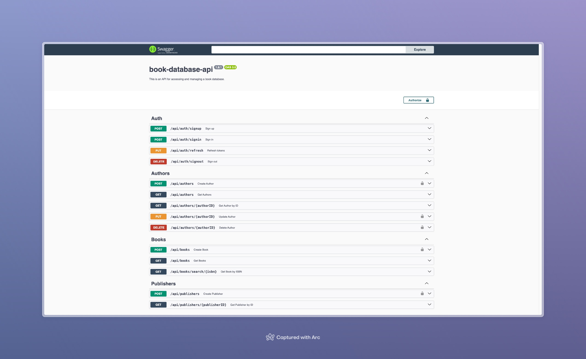

## Book Database API 

This API is designed for **book management**, using `Express.js` in a `Node.js` environment. It uses `Redis` for `authentication blacklisting` and `PostgreSQL` for secure data storage. The project follows the `MVC + Service + Repository` pattern for a clean and organized structure. Documentation is provided via `Swagger` and `JSDoc`. Testing is conducted using `Jest` and `SuperTest`. Automated releases and version control are facilitated with `Semantic Release` and `GitHub Actions` to streamline the development process.

### Screens

